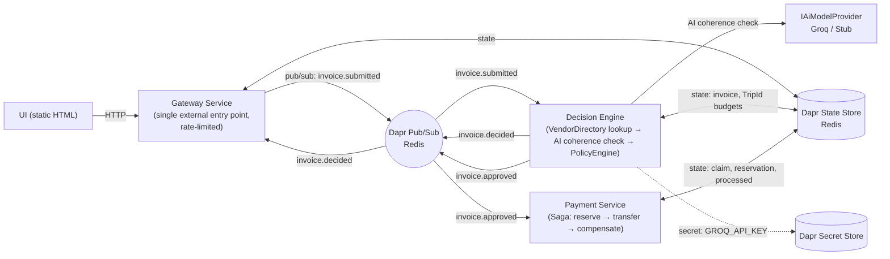
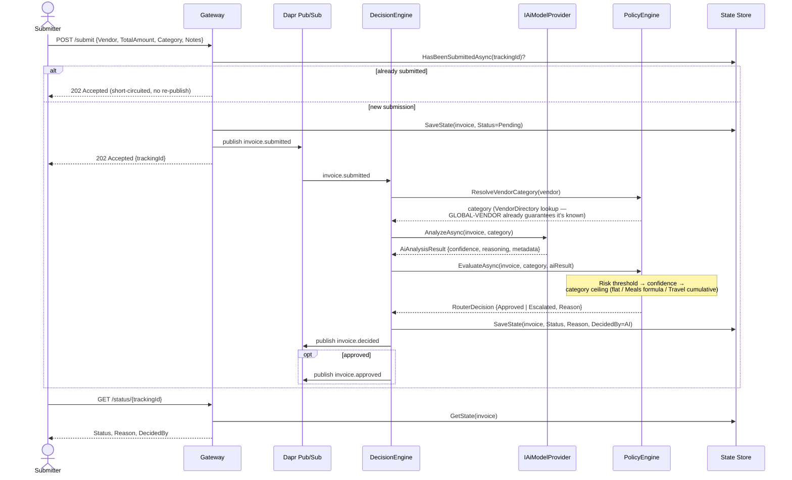
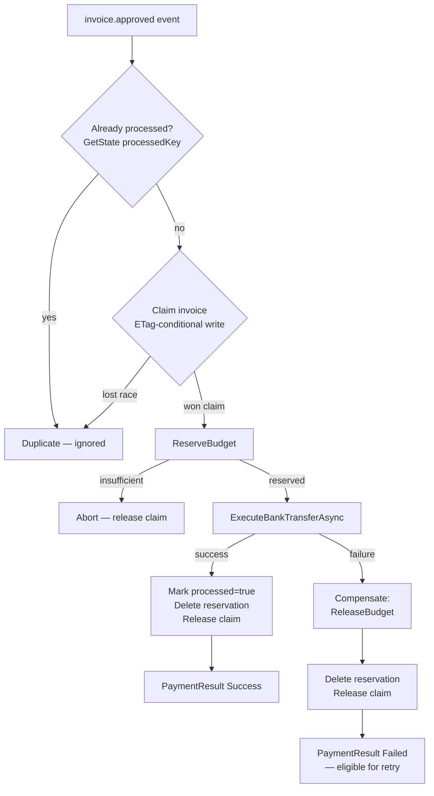

# ApprovalFlow — Architecture

## System Overview

Every service talks to the others only through its Dapr sidecar — pub/sub for
`invoice.submitted` / `invoice.decided` / `invoice.approved`, and the shared Redis-backed
state store for durable invoice records, idempotency claims, and per-`TripId` budgets.
The Gateway is the only service with a published port; DecisionEngine and PaymentService
are reachable only via their sidecars (M6).

## Sequence: Invoice Submission → Decision

Escalated items surface on `GET /escalations`; an approver calls `POST /approve/{id}` or
`POST /reject/{id}` on the Gateway, which resumes the workflow exactly where the AI left
it off — the underlying invoice record and its `TrackingId` never change, so nothing about
the pause is special-cased in the payment flow that follows.

## Payment Flow & Compensation (Saga)

The claim (step C) is what makes this safe under Dapr's at-least-once pub/sub delivery:
two concurrent deliveries of the same `invoice.approved` event race on the same
ETag-guarded write, and only one can win it. A **failed** transfer releases the claim, so
a legitimate retry later is not permanently blocked — only a **completed** payment is
permanently deduped (`processed` key). See ADR 002.

---

# Architecture Decision Records (ADRs)

This document captures the key architectural decisions made for the ApprovalFlow system, outlining the context, the decision, and the resulting consequences.

---

## ADR 001: Adoption of Dapr for Distributed Infrastructure
**Date:** July 2026
**Status:** Accepted

### Context
The assignment requires a microservices architecture (M3) that handles asynchronous events, durable state for Human-in-the-Loop pauses (M11), and cumulative state tracking for trip budgets (M5). Managing the SDKs and connections for message brokers (e.g., RabbitMQ/Kafka) and state stores (e.g., Redis) tightly couples the business logic to specific infrastructure.

### Decision
We adopted **Dapr (Distributed Application Runtime)** as a sidecar architecture for all microservices. 
- We use Dapr **Pub/Sub** for decoupled asynchronous communication (`invoice.submitted`, `invoice.approved`).
- We use Dapr **State Store** to maintain the durable state of paused human reviews and to track cumulative `TripId` budgets for travel expenses.

### Consequences
- **Positive:** Business logic (C# Minimal APIs) is entirely decoupled from infrastructure. We can swap the underlying message broker without changing a single line of application code.
- **Positive:** Built-in resilience (retries, rate limiting) is handled by the sidecar.
- **Negative/Trade-off:** Adds operational overhead, requiring `docker-compose` to orchestrate both the application containers and their respective `daprd` sidecars.

---

## ADR 002: Saga Pattern for Distributed Transactions (Payment Flow)
**Date:** July 2026
**Status:** Accepted

### Context
The system must guarantee consistent outcomes across services, particularly in the payment flow. We must ensure there are no orphaned budget reservations or double payments if a downstream process fails (F3, M9). In a distributed environment, traditional ACID database transactions (like Two-Phase Commit) are too slow and create tight coupling.

### Decision
We implemented the **Saga Pattern** (Choreography via Dapr Pub/Sub) within the Payment Service.
Instead of locking databases, the workflow uses a sequence of local transactions:
1. **Execute:** `ReserveBudget` is called.
2. **Execute:** `ProcessBankTransfer` is attempted.
3. **Compensate:** If the bank transfer fails, a `ReleaseBudget` (Rollback) local transaction is triggered to free the funds.

### Consequences
- **Positive:** High availability and loose coupling. Services do not block each other waiting for locks.
- **Positive:** Fulfills the idempotency requirement (M10) via `TrackingId`-keyed state: a
  short-lived ETag-conditional "claim" taken before any work starts (so two concurrent
  deliveries of the same event can't both proceed) and a permanent "processed" record
  written only after a real success (so a failed attempt can still be retried later).
- **Negative/Trade-off:** Introduces *Eventual Consistency*. The system might briefly show funds as reserved before the compensation logic completes the rollback. This trade-off is widely accepted in highly scalable financial systems.

---

## ADR 003: Data-Driven PolicyEngine with a Swappable AI Provider
**Date:** July 2026
**Status:** Accepted

### Context
The Dilemma (assignment brief) requires choosing an autonomy posture per expense
category, encoding it in code, and proving it can never be overstepped (M12) — while
still letting a controller change thresholds without a redeploy (F7, M13). The AI's role
is coherence review and extraction only; it must not be able to talk its way past a
ceiling — and, since `GLOBAL-VENDOR` already guarantees any vendor reaching it is in
`VendorDirectory`, it isn't asked to classify the category either. `PolicyEngine` resolves
the category with a plain lookup (`ResolveVendorCategory`); the AI's job is to judge
whether the submission's `Notes`/`LineItems` actually look coherent with that category
(and to flag it, via a lower confidence, when they don't — the closest thing this system
has to an AI-driven fraud signal, on top of the deterministic guardrails below).

### Decision
- **PolicyEngine is deterministic and does not depend on the AI for the category at
  all.** It reads `Policies/policies.json` (bind-mounted, not baked into the image — see
  below) and evaluates, in order: (1) a flat `RiskThreshold` ($5000) that applies
  regardless of category; (2) a per-category minimum confidence, now read as "how
  coherent is this submission" rather than "how sure is the AI of the category"; (3) the
  category rule itself — flat ceilings for every category (Meals included: $75 per
  submission, since each person expenses their own meal separately) and a
  Dapr-state-backed cumulative `TripId` total + per-diem for Travel. Travel is a
  hard-coded branch rather than a generic rule DSL — with only one formula-based category,
  a small expression engine would be speculative complexity for no present benefit.
- **`IAiModelProvider` is an anti-corruption layer (M15).** `StubAiModelProvider` is a
  deterministic keyword-based coherence checker used by default and in CI/tests, so builds
  never depend on a live LLM or hit a rate limit. `GroqAiModelProvider` calls a free-tier
  LLM and is selected via the `AiProvider` config key — swapping providers is a config
  change, not a code change. Any provider failure (timeout, bad response, missing key)
  is caught at the call site and forces `RouterDecision.Escalated(...)`; it never falls
  through to an approval.
- **Secrets vs. config.** The Groq API key is fetched via `DaprClient.GetSecretAsync`
  against a `secretstores.local.env` component (M5's "secrets" building block). Policy
  thresholds, by contrast, are bind-mounted from the host and read via
  `IConfiguration` + `reloadOnChange: true` rather than Dapr's Configuration API: Dapr
  Configuration is read/subscribe-only from the app's side (there is no "write config"
  call an app can make), so using it here would need extra seeding tooling with no
  corresponding requirement forcing it — the bind mount already satisfies "changeable
  without a redeploy" (F7, M13) with far less moving parts.

### Consequences
- **Positive:** M12's proof does not depend on trusting the AI at all for the category —
  the AI is never asked to choose one, so there is nothing for a gamed/hallucinated
  response to redirect. The `RiskThreshold` remains a category-agnostic backstop on top of
  that for the amount itself.
- **Positive:** Threshold changes (e.g. raising the SaaS ceiling) are a file edit and a
  few seconds' wait for `reloadOnChange`, not a container rebuild.
- **Trade-off:** The `Other` fallback category and Travel's cumulative-trip-cap special
  case mean a brand-new category with its own formula still requires a code change, not
  just a config change — accepted because the assignment's category list is fixed by
  `policy.md`.