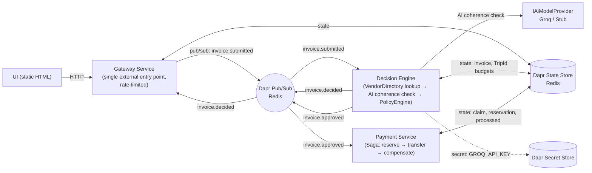
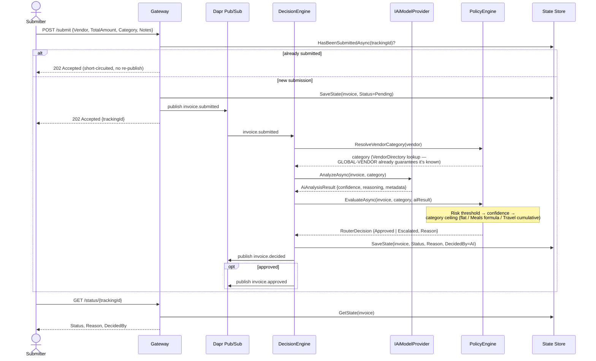
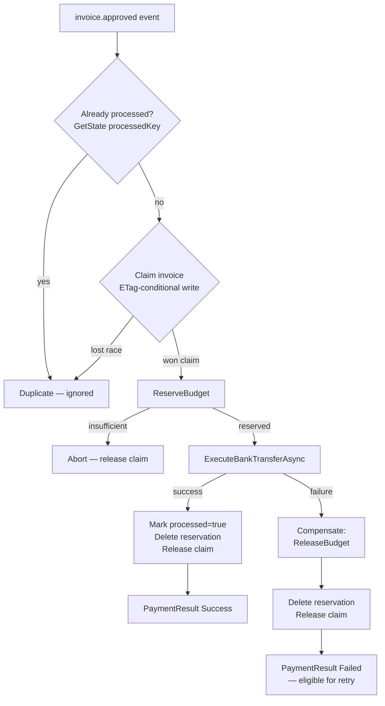

# ApprovalFlow — Architecture

## System Overview

Every service talks to the others only through its Dapr sidecar — pub/sub for
`invoice.submitted` / `invoice.decided` / `invoice.approved`, and the shared Redis-backed
state store for durable invoice records, idempotency claims, and per-`TripId` budgets.
The Gateway is the only service with a published port; DecisionEngine and PaymentService
are reachable only via their sidecars (M6).

## Sequence: Invoice Submission → Decision

Escalated items surface on `GET /escalations`; an approver calls `POST /approve/{id}` or
`POST /reject/{id}` on the Gateway, which resumes the workflow exactly where the AI left
it off — the underlying invoice record and its `TrackingId` never change, so nothing about
the pause is special-cased in the payment flow that follows.

## Payment Flow & Compensation (Saga)

The claim (step C) is what makes this safe under Dapr's at-least-once pub/sub delivery:
two concurrent deliveries of the same `invoice.approved` event race on the same
ETag-guarded write, and only one can win it. A **failed** transfer releases the claim, so
a legitimate retry later is not permanently blocked — only a **completed** payment is
permanently deduped (`processed` key). See ADR 002.

---

# Architecture Decision Records (ADRs)

Each key decision is captured as a standalone ADR (context → decision → consequences)
under [docs/adr/](adr/):

| ADR | Decision |
| --- | --- |
| [ADR 001](adr/001-dapr-distributed-infrastructure.md) | Adoption of Dapr for distributed infrastructure (pub/sub, state, secrets via sidecars) |
| [ADR 002](adr/002-saga-payment-flow.md) | Saga pattern for the payment flow (reserve → transfer → compensate, idempotent claiming) |
| [ADR 003](adr/003-policy-engine-and-swappable-ai-provider.md) | Deterministic PolicyEngine with a swappable AI provider (the numbers are config, the gate is code) |
| [ADR 004](adr/004-file-based-policy-configuration.md) | File-based dynamic policy configuration (bind mount + reloadOnChange, vs. Dapr Configuration) |